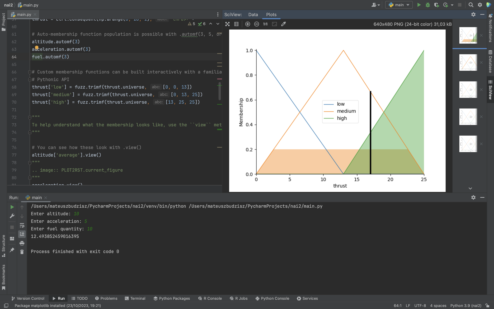
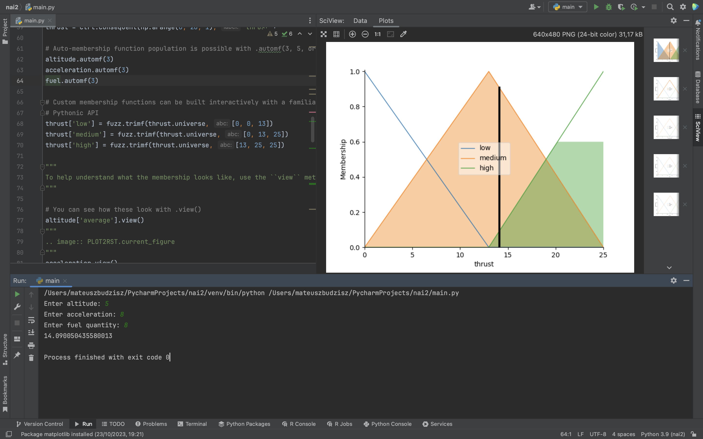
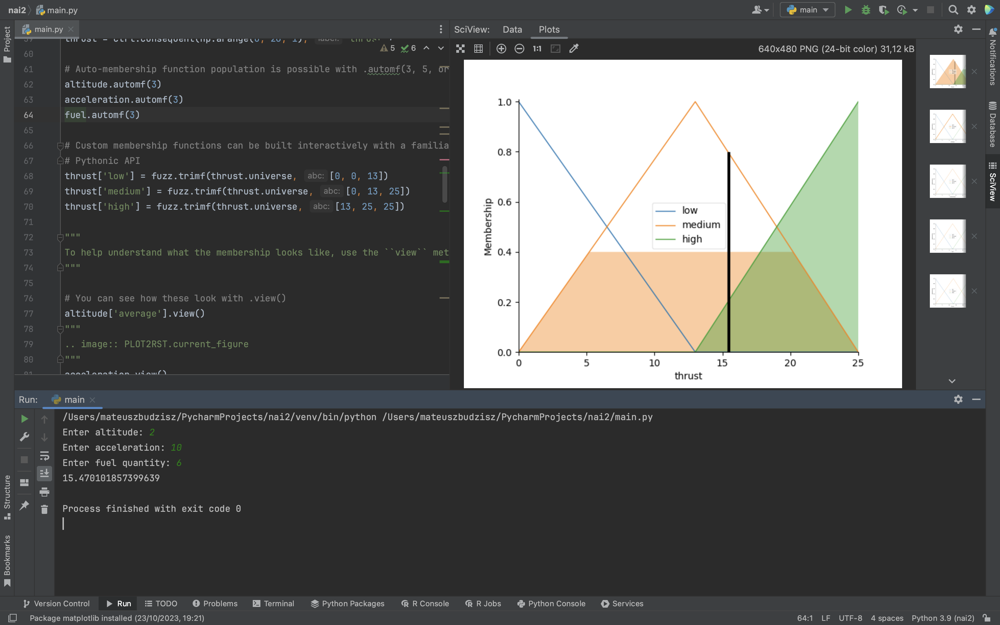

# Fuzzy Control Systems: The Lunar Lander

## Overview
This code showcases a fuzzy control system designed for simulating the landing of a lunar lander. The system employs the skfuzzy library to model the landing process and determine the necessary thrust for a safe landing based on the current altitude, acceleration, and fuel levels.

## Problem Formulation
The problem is framed as follows:

- **Antecedents (Inputs):**
    - `altitude`
        - Universe (crisp value range): Represents the altitude of the lunar lander (ranging from 0 to 10).
        - Fuzzy set (fuzzy value range): low, medium, high.
    - `acceleration`
        - Universe: Represents the acceleration (how fast we gain speed towards planet) of the lunar lander (ranging from 0 to 10).
        - Fuzzy set: low, medium, high.
    - `fuel`
        - Universe: Represents the remaining fuel of the lunar lander (ranging from 0 to 10).
        - Fuzzy set: low, medium, high.

- **Consequents (Outputs):**
    - `thrust`
        - Universe: Represents the thrust required for a successful landing (ranging from 0 to 25).
        - Fuzzy set: low, medium, high.

## Usage
To utilize this control system, users can input specific values for `altitude`, `acceleration`, and `fuel`. The system will then calculate and propose the required `thrust` for a secure lunar lander landing based on the defined fuzzy rules.

## Dependencies
Ensure that you have installed the necessary libraries by running the following commands:
- `pip install scikit-fuzzy`
- `pip install matplotlib`

Then run main.py using `python3 main.py` or use Pycharm.

## Example run screenshots

## Control System Creation and Simulation
The control system is established using the predefined rules, and a `ControlSystemSimulation` object is utilized to simulate the lunar lander's descent for particular input values. The resulting `thrust` is computed and can be visually represented.

## Note
The fuzzy logic-based control system is capable of handling imprecise and uncertain conditions during the landing process, making it suitable for real-time decision-making.

## Authors
- [Mateusz Budzisz](https://github.com/ElectroluxV2)
- [Aleksander Guzik](https://github.com/OlekMeister)
