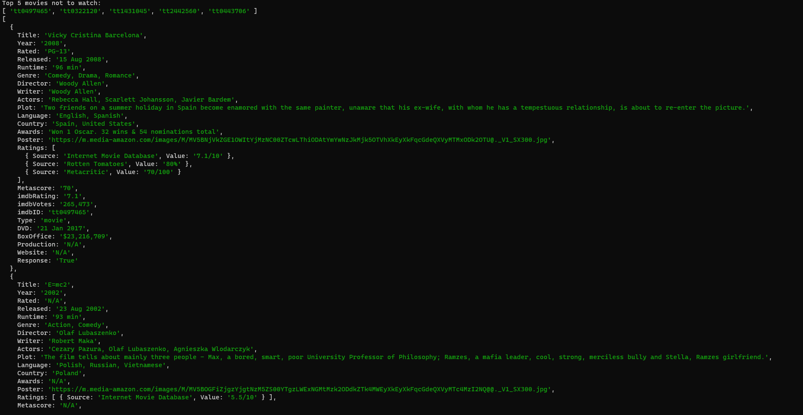

# Movie Recommendation System using k-Means Clustering

This program implements a movie recommendation system based on k-Means clustering. It takes user input, calculates the similarity between users using a specified distance method, and then recommends movies based on the preferences of similar users.

## Data preparation
- Collect data (you may use Google sheets)
- Convert data to `csv` file where fist row defines columns and rest are values
- The First column must be unique name (eg.: user firstname and surname), rest columns must be ids of imdb
- Convert to `json`, you may use [csvjson.com](https://csvjson.com/csv2json)
## API preparation

 #### Movie ratings data is stored in 'data.json', sourced from the [IMDB API](https://collectapi.com/api/imdb).
  To access the API, you need to obtain an API key. Here's how you can do it:

  - Visit the [IMDB API](https://collectapi.com/api/imdb) website.
  - Sign up for an account or log in if you already have one.
  - Once logged in, navigate to the API documentation section.
  - Find the section on obtaining an API key and follow the provided instructions.
  - Copy the generated API key.

  #### Now that you have your API key, insert it into the code:

  - Open the code file where the API key is required.
  - Replace the placeholder text 'YOUR_API_KEY' with the actual API key you obtained.

## Running
- Prepare `node` in version `21`
- Next to `package.json` run `npm ci`
- Run `npm start euclidean` to get recommendations based on euclidean distance
- Run `npm start manhattan` to get recommendations based on manhattan distance
- You can add your own distance method to `distance.mjs` use `node main.mjs <your distance function>` to test it.

## Example Run

### Euclidean

### Manhattan

## Authors

- [Mateusz Budzisz](https://github.com/ElectroluxV2)
- [Aleksander Guzik](https://github.com/OlekMeister)